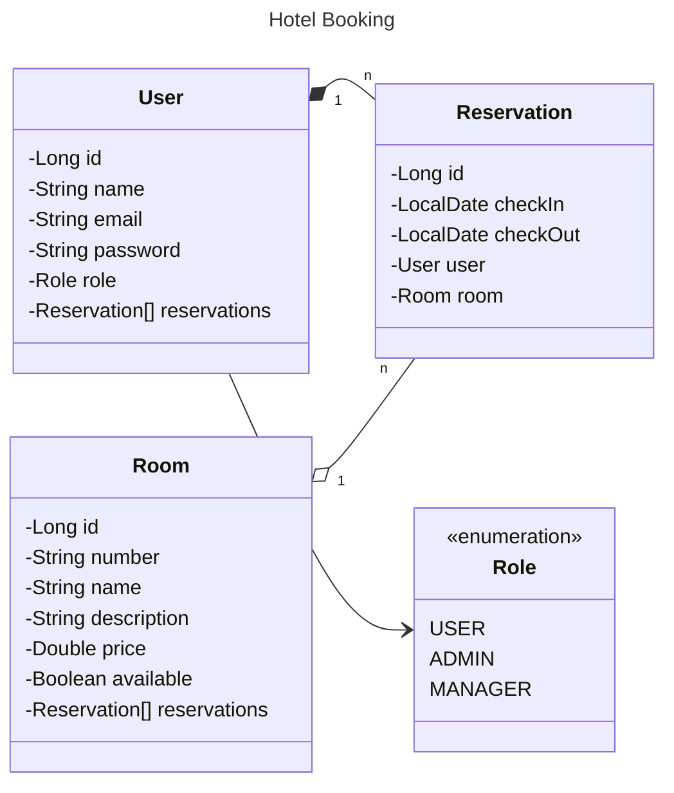

# API Reserva de hotel (HotelBooking)

Esta API RESTful tem o objetivo de aprimorar habilidades em Java e Spring, foi criada para fazer a gestão de reservas de hotel, permitindo cadastro de usuários, busca de quartos, criação de reservas e pagamentos, com autenticação e segurança via JWT.
 
