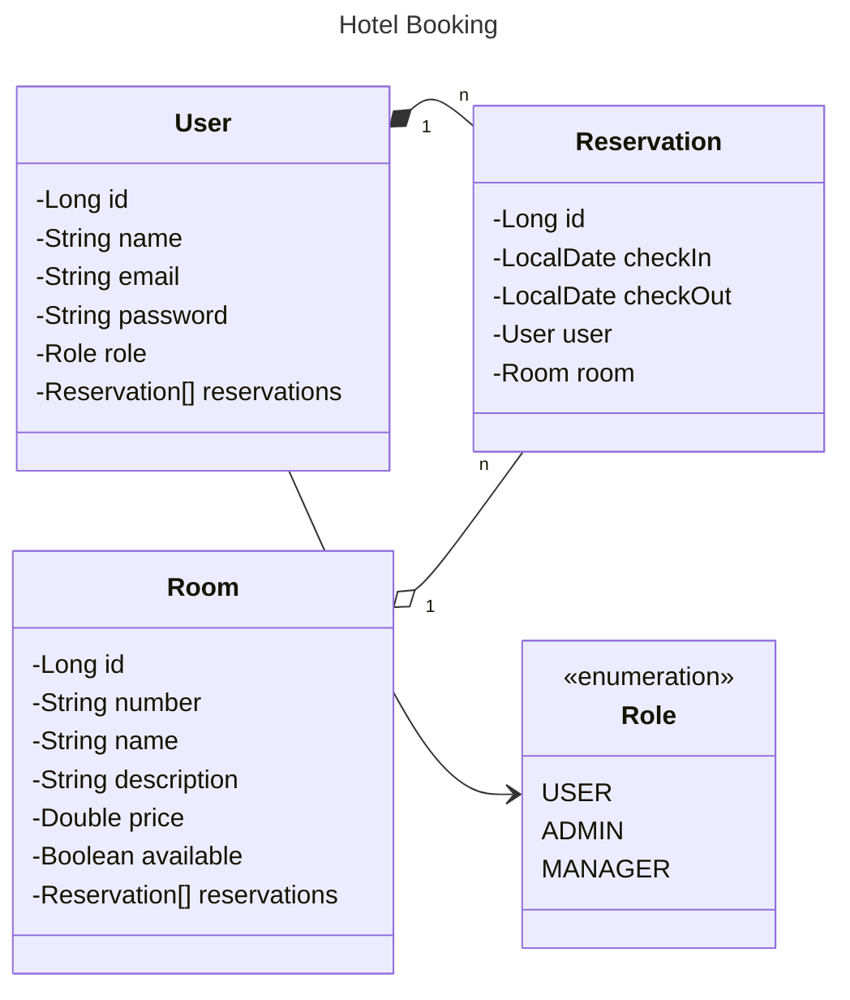

# API Reserva de hotel (HotelBooking)

Esta API RESTful tem o objetivo de aprimorar habilidades em Java e Spring, foi criada para fazer a gestão de reservas de hotel, permitindo cadastro de usuários, busca de quartos, criação de reservas e pagamentos, com autenticação e segurança via JWT.
 

```mermaid
---
title: Hotel Booking
---

classDiagram
    direction LR
    class User {
        -Long id
        -String name
        -String email
        -String password
        -Role role
        -Reservation[] reservations
    }
    
    class Role {
		    <<enumeration>>
		    USER
		    ADMIN
		    MANAGER
	  }

    class Reservation {
        -Long id
        -LocalDate checkIn
        -LocalDate checkOut
        -User user
        -Room room
    }

    class Room {
        -Long id
        -String number
        -String name
        -String description
        -Double price
        -Boolean available
        -Reservation[] reservations
    }

    User "1" *-- "n" Reservation
    Room "1" o-- "n" Reservation
    User --> Role
```
## Endpoints

Para testar os endpoint acesse a docupentação pelo Insomnia.

